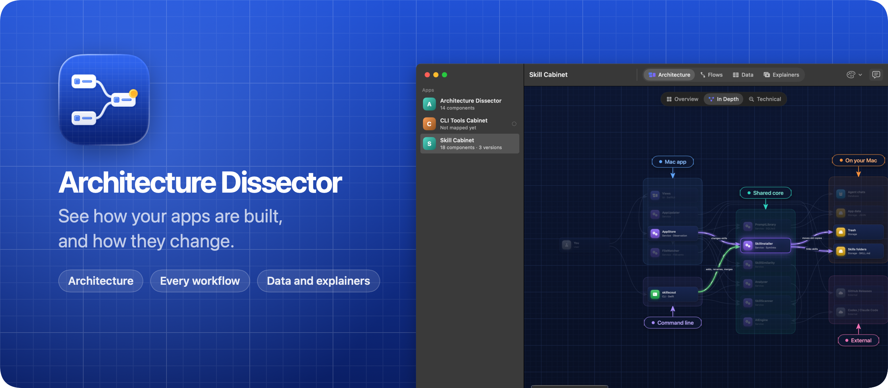
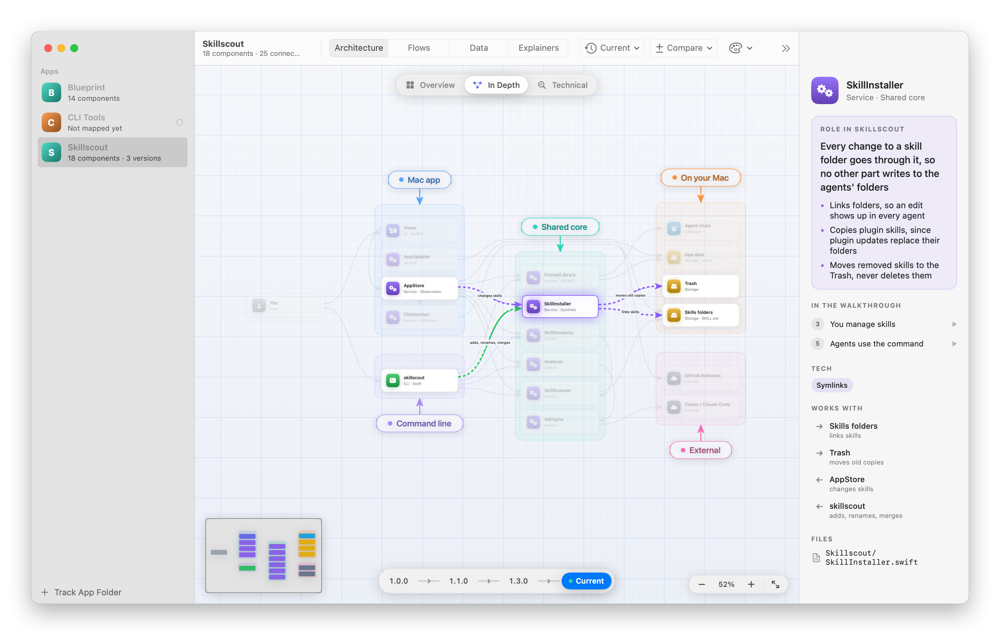
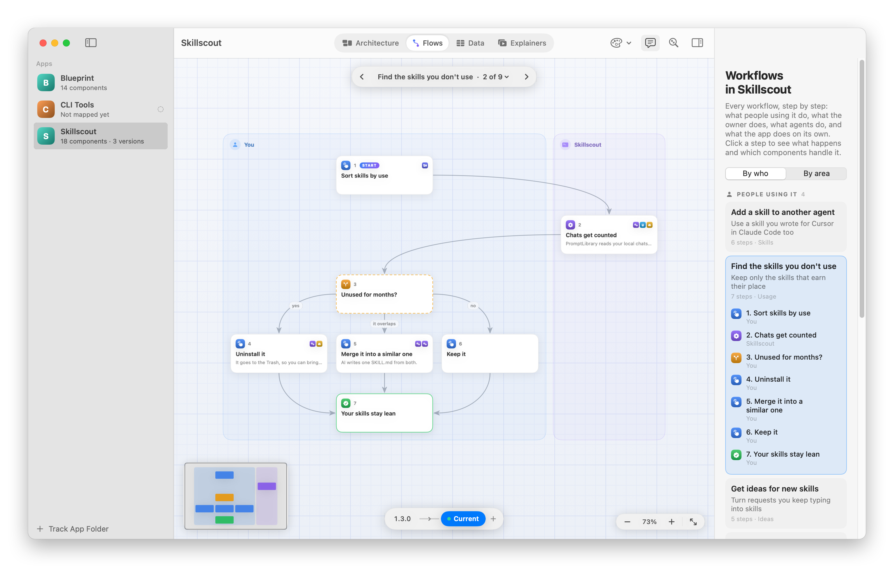
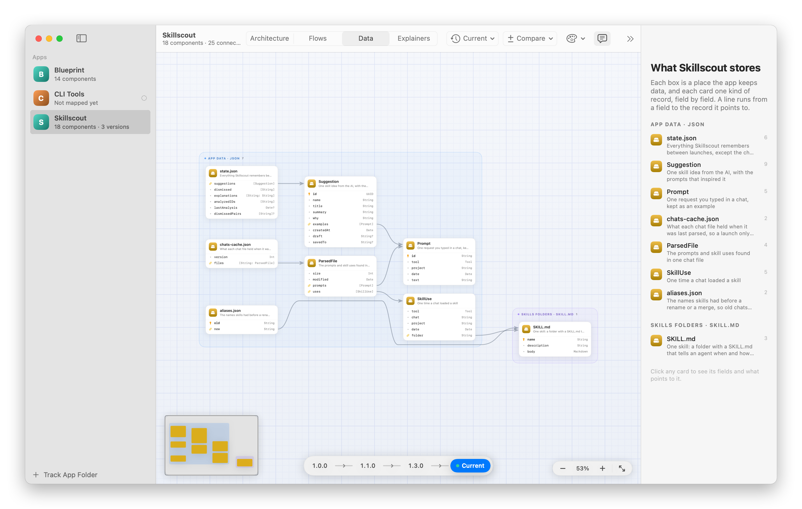
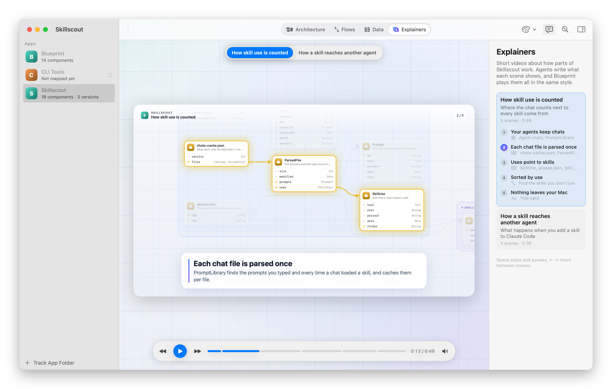
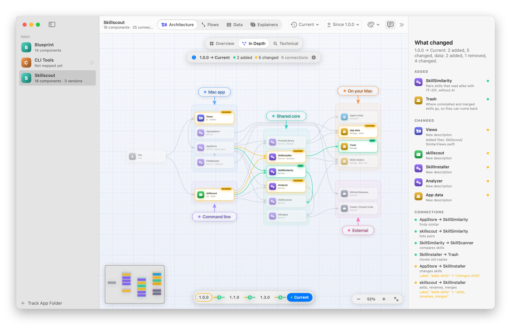
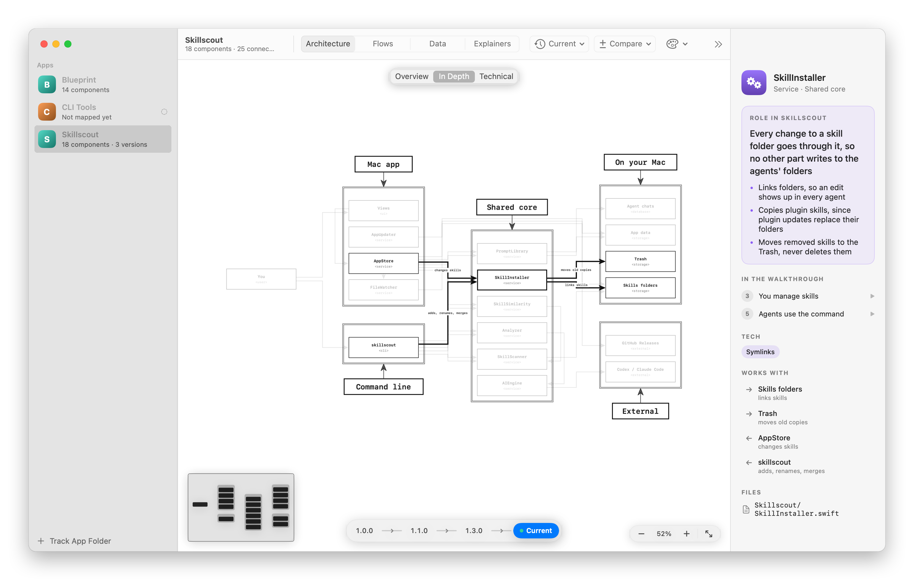

Blueprint draws how your apps are built, every workflow that goes through them and the data they store, from maps your coding agents write. Ask an agent working in a project to add it to Blueprint, and a minute later you can click through its components, flows, database tables and short explainer videos.

It also watches each project. When the code moves on, it tells you which parts changed, and it shows what changed between any two versions you saved.

## Download

Get `Blueprint-1.0.0.zip` from the [latest release](https://github.com/flaviocopes/blueprint/releases/latest), unzip it, and drag Blueprint to your Applications folder. It runs on macOS 15 Sequoia or later, on Apple silicon and Intel Macs.

### Opening it the first time

Blueprint is signed with my Apple Developer ID and notarized by Apple. The first time you open it, macOS asks if you're sure you want to open an app downloaded from the internet. Click **Open**.

On a work laptop you might not be able to install apps in `/Applications`. You can keep Blueprint in the `Applications` folder inside your home folder instead.

### Updates

Once a day, Blueprint asks GitHub whether there's a newer version. When there is, it shows what's new, and **Install and Relaunch** puts it in place of the old one. **Blueprint → Check for Updates…** checks right away.

To turn off the daily check, run this in Terminal:

```sh
defaults write com.flaviocopes.blueprint AppUpdaterAutomaticChecks -bool false
```

## Set it up

You don't draw anything in Blueprint. Your coding agents map each app with the `blueprint` command, and Blueprint draws what they save. The welcome screen walks you through these steps, and **Blueprint → Set Up Agents…** shows them again any time.

1. **Install the command.** Choose **Blueprint → Install Command Line Tool**. It links `blueprint` into `/usr/local/bin`, so agents can run it from any project.
2. **Install the agent skill.** Choose **Blueprint → Install Agent Skill**. It copies a skill to `~/.agents/skills/blueprint` and links it for Claude Code, Cursor and Codex, so they know when and how to use Blueprint in every project. When an update brings a newer skill, Blueprint refreshes it.
3. **Track an app.** Drop its folder on the window. Blueprint watches the folder, and only ever reads it.
4. **Ask an agent to map it.** Open your coding agent in that app and paste:

   ```text
   Add this app to Blueprint and map it, including its past releases. Run `blueprint guide` and follow it.
   ```

   The agent reads the code and saves the map, and the diagram shows up as soon as it does.
5. **Keep it current.** Add this to the app's `AGENTS.md` or `CLAUDE.md`, so every agent that works on it reads the map first and updates it after a change:

   ```markdown
   ## Blueprint

   This app is mapped in Blueprint. Before changing it, read the map with `blueprint show --json`, or `blueprint show --data --json` for what it stores. After changing its structure, workflows or stored data, run `blueprint status`, update the map as `blueprint guide` explains, and save it with `blueprint set`.
   ```

When you ship a release, ask the agent to save a version, or run `blueprint snapshot --version 1.2.0` yourself. Later on, `blueprint list` tells an agent which apps still need their flows, data or explainers, and `--missing data` lists only the ones without data, so "fill in what's missing in Blueprint" is enough for it to work through them all.

## Features

### The architecture

Every app is a set of components (a module, a screen, a worker, a database, a third-party service) in groups that say where they run, with connections that say who calls, reads or writes what. Each group is a box, and boxes follow the connections from left to right.

Open an app and the inspector says what it is in a sentence or two, then how it works in a few short steps. Click a step, or **Take the Tour**, and the canvas zooms to the components involved while data flows between them. Click any component to see its role, a few points that make it precise, its tech, its files and what it works with.

<picture>
  <source media="(prefers-color-scheme: dark)" srcset="docs/screenshot-dark.png" />
  
</picture>

Pinch, ⌘-scroll or turn a mouse wheel to zoom, scroll or drag to move around, and use the minimap to jump. ⌘1 fits the whole diagram.

### Flows

Flows show every workflow that goes through an app, as a flowchart: steps from top to bottom, one column for each actor, decisions that branch. Each flow says whose it is (people using the app, its owner, agents working through its CLI or API, or the app on its own) and which area it belongs to, and the inspector groups them by either. Click a step to see what happens and which components handle it.



### Data

The Data tab draws what an app stores: database tables, collections, JSON files and settings. Each store is a box and each entity a card with a row per field, with keys marked and a line from every field that points to another entity. Agents can read the same schema with `blueprint show --data --json` before they change the code.



### Explainers

Explainers are short videos about how parts of an app work, like "How skill use is counted". An agent writes the scenes: a title, a sentence or two, and what each scene shows. Blueprint plays them in the same style for every app, with the camera gliding across the real diagrams, captions, and sound effects for what happens on screen.



### Versions and changes

When an agent saves a map, Blueprint records the hash of every file in the folder. From then on it knows which files changed, whether you committed them or not, and marks the components they belong to.

Save a version at each release and the timeline lets you compare any two: new components in green, changed ones in amber with what changed, removed ones in red. In the Data tab, the schema shows how it migrated, field by field.



### Themes

The palette button restyles every diagram without moving anything: **Blueprint**, the default, **Terminal** with green phosphor on a black screen, **Minimal** with hairlines and no grid, and **ASCII**, like a diagram drawn in [Monodraw](https://monodraw.helftone.com).



## The blueprint command

| Command | What it does |
|---|---|
| `blueprint list [--missing <part>]` | The tracked apps, whether their map is up to date, and what's missing |
| `blueprint add [folder]` | Track an app folder |
| `blueprint guide` | How to map an app, for agents |
| `blueprint set [--file <path>]` | Save an app's map from JSON |
| `blueprint show [--data] [--json]` | Print the map, or the JSON to edit. `--data` prints only what the app stores |
| `blueprint status` | What changed in the code since the last save |
| `blueprint snapshot [--version <v>]` | Save the current map as a version |
| `blueprint versions` | The saved versions |
| `blueprint diff [--from <v>] [--to <v>]` | What changed between two versions |
| `blueprint open [--compare <v>]` | Show the app in Blueprint |
| `blueprint remove` | Stop tracking an app |

Inside a tracked folder, the commands pick that app. Elsewhere, pass its id, its name or its folder. Run `blueprint help <command>` for the options.

## Privacy

Blueprint only reads your app folders, with read-only git commands, and never writes to them. Everything it saves stays in `~/Library/Application Support/Blueprint`. Once a day, it asks GitHub whether there's a newer version of Blueprint, and it downloads one only when you click **Install and Relaunch**. There are no accounts and nothing else goes online.

## Build it from source

You need macOS 15 or later, Xcode 26 and [XcodeGen](https://github.com/yonaskolb/XcodeGen).

Run `xcodegen generate`, open `Blueprint.xcodeproj` and press `⌘R`. To build the release zip from the terminal, run:

```sh
scripts/build-release.sh
```

It builds a universal app in `build/release/Release/Blueprint.app` and zips it into `dist/`. With my Developer ID certificate in the keychain it signs and notarizes the app. Everywhere else it signs it ad hoc, so your copy is signed ad hoc. A copy you build yourself opens without a warning on your Mac.

If you send it to another Mac, macOS says it "could not verify Blueprint is free of malware". Click **Done**, then go to **System Settings → Privacy & Security** and click **Open Anyway**, or remove the quarantine flag in Terminal:

```sh
xattr -dr com.apple.quarantine /Applications/Blueprint.app
```

## Development

```sh
xcodegen generate                  # after editing project.yml
scripts/screenshot.sh              # the screenshots in docs/, from the demo maps in scripts/demo
swift scripts/render-banner.swift  # docs/banner.png
swift scripts/render-icon.swift    # the app icon
scripts/fuzz-layout.sh             # random maps through every layout, checked for overlaps
```

Working with an AI coding agent? Point it at [AGENTS.md](AGENTS.md). It has the commands and the rules to follow.

## How it works

Agents write each map as JSON: components, connections, flows, entities and explainer scenes, all by id. Blueprint checks it, saves it with a hash of every file in the folder, and lays it out on its own: groups become boxes in columns that keep connections short, connections run through the gaps between boxes, and the flow and data views get layouts of their own. Every layout is checked against hundreds of random maps for overlaps.

Versions are compared by id, so a map stays comparable as long as agents keep their ids, which the guide asks them to do. Explainers are scenes that point at those same ids, and Blueprint plays them on the real diagrams instead of rendering a video file.

## License

[MIT](LICENSE)
